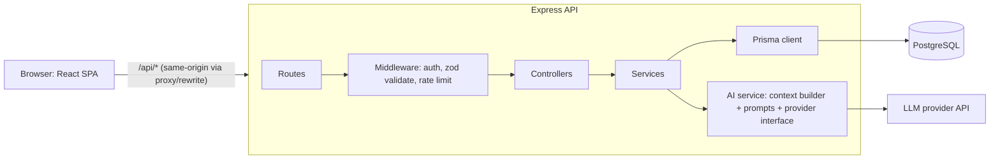

# Architecture Overview

Phase 1 design review for Smart Internship Tracker + AI Interview Prep, written in October 2026 before implementation began. Database design is in [../database/erd.md](../database/erd.md), the API in [../api/rest-api.md](../api/rest-api.md), and decision records in [../decisions](../decisions).

## Starting point

The repository began as an unmodified Vite + React template (`client/`) and an Express 5 dependency list with no source (`server/`). These were renamed to `frontend/` and `backend/`, and the React + Vite and Express choices were kept.

## 1. Problems and gaps in the requirements

| # | Gap | Why it matters | Recommendation |
|---|-----|----------------|----------------|
| 1 | **Conversion rates can't be computed from the current status alone** | If an app went Interviewing → Rejected, it now just shows "Rejected", and the history is lost | Add an `application_status_history` table, which also powers "recent activity". Interview conversion = apps that ever reached an interview / apps that were applied to |
| 2 | **"Active application" isn't defined** | Dashboard counts would be ambiguous | Active = Applied, Online Assessment, Interviewing. Saved = not yet applied. Terminal = Offer, Rejected, Withdrawn |
| 3 | **Conversion denominators aren't defined** | Different formulas give different numbers | Denominator = apps with status ≠ Saved (i.e. `date_applied` set) |
| 4 | **"Resume information" has no home in the ERD** | The AI context depends on it | MVP: a `resume_text` field on the profile (pasted text). PDF upload/parsing comes later, since it needs file storage and a parser |
| 5 | **Internship pay is usually hourly** | `salary_min`/`salary_max` alone is ambiguous | Add `salary_period` (HOURLY / MONTHLY / YEARLY) |
| 6 | **Interview `type` and `stage` overlap** ("Final Round" appears as a type) | The two fields would get used inconsistently | `interview_type` = format (Recruiter Screen, Behavioral, Technical, Coding Assessment, Hiring Manager, Other). Replace free-text `stage` with an integer `round` (1, 2, 3…) plus an optional `is_final` flag |
| 7 | **No storage for AI outputs the user wants to keep** | Epic 5 says "revise before saving", and JD analysis "may later be used by the question generator" | Add `job_analyses` and `application_responses` tables (see [database design](../database/erd.md)) |
| 8 | **AIConversation/AIMessage models a chatbot**, which the spec explicitly says not to build | Structured features don't fit a message log | Replace them with task-specific tables (see [database design](../database/erd.md)) |
| 9 | **Follow-ups have no "done" state** | Overdue follow-ups would show on the dashboard forever | MVP: the user clears or reschedules the date. The dashboard shows overdue items plus the next 7 days |
| 10 | **No pagination requirement** | "Dozens" of applications becomes hundreds | Paginate `GET /applications` from day one |
| 11 | **No rate limiting or AI cost controls** | Login brute force; AI bill abuse on a public deployment | Rate-limit `/auth/*` and `/ai/*`, with a per-user daily AI quota |
| 12 | **AI-specific security isn't covered** | Model output is untrusted text; resumes go to a third party | Render AI output as text or sanitized markdown (never `dangerouslySetInnerHTML`), validate structured output with a schema, disclose the AI provider in the README/privacy note |
| 13 | **Timezones aren't specified** | Interview times shown wrong | `interview_date` as `timestamptz`; `date_applied`, `follow_up_date` and `graduation_date` as `DATE` |
| 14 | **Account lifecycle** (password reset, email verification, delete account) isn't specified | Users expect it eventually | Out of MVP, except that every FK cascades from User so account deletion is easy to add later |
| 15 | **Deployment comes last (Phase 8)** | Cookie/CORS problems across domains usually show up only in production | Deploy a "walking skeleton" in Phase 2 and redeploy continuously |

## 2. Move out of the MVP

The **MVP = a deployed, tested tracker (Phases 2–5)**. AI becomes v1.1, which builds on a stable base.

Move out:
- **All AI features**, plus **Projects and Experience CRUD** (they only exist to feed the AI, so build them at the start of the AI phase)
- Resume file upload and parsing (use pasted `resume_text` instead)
- Password reset, email verification, OAuth/social login
- Email or push reminders for follow-ups
- Kanban drag-and-drop board (a list with a status dropdown is enough)
- CSV import/export, browser extension, a Company entity
- Multiple answer attempts per practice question, and score trends
- E2E tests (Phase 7)

Keep in the MVP, since they're cheap: location filter (text match), status history, pagination.

## 3. Finalized MVP (v1.0)
1. **Auth:** register, login, logout, `GET /me`, hashed passwords (argon2id), httpOnly-cookie auth, every query scoped to the user
2. **Profile (basic):** school, major, graduation date, bio, skills, resume text
3. **Applications:** CRUD; status changes recorded in history; search (company/position), filter (status, location), sort (date applied, updated), pagination
4. **Interviews:** CRUD nested under an application; type, round, date/time, interviewer, outcome, notes
5. **Follow-ups:** a follow-up date per application, surfaced on the dashboard
6. **Dashboard:** total, active, interviews, offers, rejections; upcoming interviews (14 days); follow-ups (overdue + 7 days); recent activity (from status history)
7. **Analytics:** count by status, applications per week, interview and offer conversion rates
8. **Quality bar:** input validation, consistent error format, structured logging, unit + integration tests, CI, deployed publicly, documented

**v1.1 (AI):** Projects/Experience CRUD → JD analysis → question generator + practice sessions → answer feedback → application response assistant.

## 4. System architecture



**Frontend:** the existing React + Vite, plus React Router, TanStack Query (server state: caching and invalidation after mutations), React Hook Form + Zod, and Recharts for analytics.

**Backend:** the existing Express 5, layered as **routes → controllers (HTTP only) → services (business rules, ownership) → Prisma**.
- No separate repository layer: Prisma already is the data-access abstraction, and an extra layer is over-engineering here.
- Logic that needs unit tests, like the filter/sort query builder, status-transition rules and AI context building, lives in pure functions.

**Cross-cutting pieces:**
- Zod-validated env config (fails fast at startup)
- Central error handler with `AppError` subclasses
- pino + pino-http logging (request id; redacts `password`, `cookie` and `authorization`)
- helmet, CORS limited to the frontend origin, express-rate-limit

**Authorization rule:** every query includes `userId` (`where: { id, userId }`). Another user's resource returns **404, not 403**, so its existence isn't leaked.

**Database:** PostgreSQL. It has arrays and JSONB, and free managed tiers (Neon or Supabase). Run it locally with Docker Compose.

**AI layer (Phase 6):**
- An `AiProvider` interface (`generateStructured(prompt, zodSchema)`), with one real provider (Claude or OpenAI) and a `FakeProvider` for tests
- `buildInterviewContext(user, profile, projects, application, analysis)` as pure, unit-tested functions that also handle token budgeting and truncating long JDs
- Versioned prompt templates
- Output validated against Zod schemas before saving
- Synchronous requests, with no queue (streaming is optional later)

**Testing:**
- Vitest everywhere (it fits Vite and ESM)
- Backend integration tests use Supertest against a real Postgres test DB. `app.ts` exports the app and `server.ts` calls listen
- Frontend: React Testing Library
- Playwright for E2E in Phase 7

**Deployment:** frontend on Vercel or Netlify, API on Render, Railway or Fly, DB on Neon. Use a Vercel rewrite of `/api/*` to the backend so cookies are first-party (avoids third-party-cookie blocking), or use subdomains on a custom domain. GitHub Actions runs lint, typecheck and tests (with a Postgres service container) on every PR.

### Key decisions (see ADRs in `docs/decisions`)
- **Language:** TypeScript, frontend and backend
- **ORM:** Prisma (+ Prisma Migrate)
- **Auth:** JWT in an httpOnly, Secure, SameSite=Lax cookie with a short expiry (e.g. 1 day); argon2id hashing. Document the logout limitation in an ADR. A refresh-token or denylist can come later if needed
- **Styling:** Tailwind CSS

## 5. Repository structure
```
interview-prep/
├── frontend/                 (renamed from client/)
│   └── src/
│       ├── api/              fetch wrapper + per-resource API functions
│       ├── features/         auth/ applications/ interviews/ dashboard/ profile/ ai/
│       ├── components/       shared UI
│       ├── routes/           pages + router config
│       └── lib/ hooks/ test/
├── backend/                  (renamed from server/)
│   ├── src/
│   │   ├── app.ts  server.ts
│   │   ├── config/env.ts
│   │   ├── lib/              prisma.ts logger.ts
│   │   ├── middleware/       requireAuth validate errorHandler rateLimit
│   │   ├── modules/          auth/ profile/ applications/ interviews/ dashboard/ ai/
│   │   │                     each: *.routes *.controller *.service *.schemas
│   │   └── utils/errors.ts
│   ├── prisma/               schema.prisma migrations/ seed.ts
│   └── tests/                unit/ integration/ helpers/
├── docs/                     architecture/ api/ database/ diagrams/ decisions/ (ADRs)
├── .github/workflows/ci.yml
├── docker-compose.yml        local Postgres (dev + test DBs)
├── .env.example  .gitignore  README.md  LICENSE
```
Modules are organized by feature rather than by layer, so each feature's code stays together. Brief ADRs in `docs/decisions/` record the choices above, which also gives you something concrete to point to in interviews.

## 6. Roadmap (build order; one feature branch per numbered group)

**Phase 1 — Design** (`docs/design`): commit this review as `docs/architecture/overview.md`, plus the ERD, API doc and ADRs.

**Phase 2 — Foundation**
1. `chore/repo-setup`: git init, rename to frontend/backend, root `.gitignore`, `.env.example`, README skeleton, LICENSE, push to GitHub
2. `chore/backend-skeleton`: TS, `app.ts`/`server.ts`, env config, logger, error handler, `/health`, Vitest + Supertest health test
3. `chore/database`: docker-compose Postgres, Prisma init, User + UserProfile migration, test-DB reset helper
4. `chore/frontend-skeleton`: stable Vite, TS, router, layout shell, API client, Vite `/api` proxy, Vitest + RTL
5. `chore/ci`: GitHub Actions (lint, typecheck, tests with a Postgres service)
6. `chore/deploy-skeleton`: deploy frontend + API + DB, and verify the same-origin `/api` rewrite works

**Phase 3 — Auth** (`feature/authentication`)
1. Register/login/logout/me service + routes, plus unit and integration tests
2. `requireAuth` middleware
3. Frontend auth pages, auth state from `/me`, protected routes
4. Profile endpoint + page

**Phase 4 — Tracker** (`feature/application-management`)
1. Application + status-history migration
2. Zod schemas + service with ownership checks (unit tests)
3. CRUD routes (integration tests, including cross-user 404)
4. List query builder: search, filter, sort, paginate (unit tests on the pure builder)
5. Frontend list + filters, create/edit form, detail page, status dropdown

**Phase 5 — Interviews, follow-ups, dashboard** (`feature/interviews`, `feature/dashboard`)
1. Interview migration + endpoints + tests
2. Interview UI on the application detail page
3. Follow-up surfacing
4. `/dashboard` endpoint + UI
5. `/analytics` endpoint + charts
6. **Deploy and tag v1.0.0**

**Phase 6 — AI** (`feature/ai-*`)
1. Projects/Experience CRUD + UI
2. AI provider interface, FakeProvider, context builder + unit tests, rate limit/quota
3. JD analysis
4. Practice sessions + question generation
5. Answer feedback
6. Application response assistant (draft → edit → save)
7. Tag v1.1.0

**Phase 7 — Quality:** Playwright E2E for the flow in the spec, security review (OWASP checklist), index/N+1 review, accessibility + responsive polish, error/empty/loading states.

**Phase 8 — Production:** CI/CD auto-deploy on merge to main, monitoring/log drain, custom domain, final README with screenshots, architecture diagram and live demo link (plus a seeded demo account).

